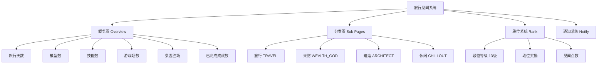
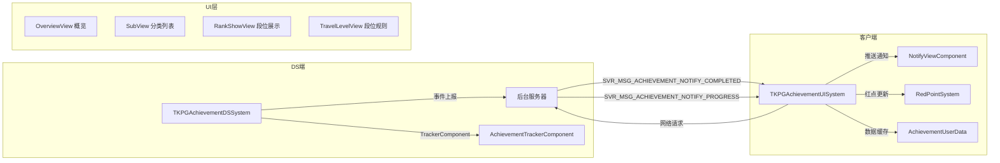

# "旅行见闻"成就系统分析

## 一、整体结构

"旅行见闻"系统是一个**多层级、多维度**的成就体系，由以下核心模块组成：



### 1.1 四大成就分类（`E_ACHIEVEMENT_CATEGORY`）

| 分类 | 枚举值 | UI 控件名 | 对应玩法 |
|---|---|---|---|
| **旅行** (TRAVEL) | 1 | `BP_AchvProgressItem_Travel` | 主世界探索、社交互动 |
| **建造** (ARCHITECT) | 2 | `WBP_AchvProgressItem_Build` | 家园建造、工作台升级 |
| **来财** (WEALTH_GOD) | 3 | `WBP_AchvProgressItem_Sport` | 来财模式（Code Evacuation）战斗/搜刮 |
| **休闲** (CHILLOUT) | 4 | `WBP_AchvProgressItem_Chill` | 派对小游戏（火锅、炸弹、滑雪等） |

### 1.2 成就品质分级（`E_ACHIEVEMENT_QUALITY`）

| 品质 | 枚举值 | 含义 |
|---|---|---|
| COMMON | 1 | 普通成就 |
| RARE | 2 | 稀有成就 |
| EPIC | 3 | 史诗成就 |

### 1.3 成就状态流转（`E_ACHIEVEMENT_STATUS`）

```
INIT(0) → COMPLETED(1) → UNLOCKED(2)
未达成      已完成可领奖     已领奖
```

### 1.4 列表筛选维度（`E_ACHIEVEMENT_LIST_TYPE`）

- **ALL** — 全部成就
- **RECENT** — 最近完成
- **UPCOMING** — 即将达成

---

## 二、段位系统（核心进度机制）

根据 `TKPGAchievementTravelLevelViewComponent.ts` 中的规则说明文本：

> "1、旅行见闻系统目前开放**13个段位**，用户通过累计见闻点数提升段位"
> "2、完成各分页旅行见闻任务可获取见闻点数，系统将选取**各分页最高点数**作为段位结算依据"

段位称号序列（从 `NewCommItem` 数据表）：
- 碗碗类青 → 辣鸡铜战神 → 加班快银 → 工位小金人 → 资本你赢了（以及更多，共13级）

### 段位奖励机制

- 每个段位有对应的 `vecRewardItem`（奖励物品列表）
- 奖励状态：`INIT`(未达到) → `COMPLETED`(可领取) → `CLAIMED`(已领取)
- 段位提升时可获得：**现金红包**（从数据表中确认）、**称号**、以及其他物品奖励
- 存在 `bIsRealGiftItem` 标记，表明部分段位奖励是**实物/现金奖励**

### 段位计算规则

- 系统选取四个分页中**最高点数**作为段位结算依据（非累加）
- 这意味着玩家可以专注于自己擅长/喜欢的分类来提升段位

---

## 三、获取条件（触发事件分析）

从 DS 端系统（`TKPGAchivementDSSytem.ts`，1698行）的接口定义和实现来看，成就触发条件覆盖了游戏的**几乎所有核心玩法**：

### 3.1 派对小游戏类（休闲分类）

| 事件类型 | 触发条件 |
|---|---|
| `HOTPOT_PUT_INGREDIENT_OWN_POT` | 火锅游戏：往自己锅里放食材 |
| `HOTPOT_PUT_LARGE_INGREDIENT_OWN_POT` | 火锅游戏：放大食材 |
| `HOTPOT_PUT_CILANTRO_ENEMY_POT` | 火锅游戏：往敌人锅里放香菜 |
| `HOTPOT_TACKLE_ENEMY_CARRY_INGREDIENT` | 火锅游戏：撞飞携带食材的敌人 |
| `FACTORY_KILLED_BY_GAS` | 工厂游戏：在毒气中被淘汰 |
| `BOMB_SAVING_ALLY` | 炸弹游戏：拯救队友 |
| `BOMB_ELIMINATE_ENEMY_BY_SUGAR_BUBBL` | 炸弹游戏：用糖泡泡淘汰敌人 |
| `SKI_SNOWBALL_FREEZE_ENEMY` | 滑雪游戏：雪球冻住敌人 |
| `SKI_KNOCK_ENEMY_OFF_CLIFF` | 滑雪游戏：把敌人撞下悬崖 |
| `SKI_PERFECT` | 滑雪游戏：完美连击 |
| `FORTY_METERS_KILL_ENEMY` | 40米大作战：击杀敌人 |
| `FORTY_METERS_BLOCK_ATTACK` | 40米大作战：格挡攻击 |
| `LIGHTNING_STRIKE_STUN` | 闪电击晕敌人 |
| `GRIP_CANDY_BUBBLE_SELF_STUCK` | 糖泡泡困住自己 |
| `WEIWEI_PEA_GUN_STUN_ENEMY` | 豌豆射手击晕敌人 |

### 3.2 通用战斗类

| 事件类型 | 触发条件 |
|---|---|
| `GAMEPLAY_KILL_ENEMY` | 击杀敌人 |
| `GAMEPLAY_ATTACK_ENEMY_FIRST` | 首次攻击敌人 |
| `GAMEPLAY_STUNNING_ENEMY` | 击晕敌人 |
| `GAMEPLAY_STUNNED` | 被击晕 |
| `GAMEPLAY_SOLO_SQUAD_WIN` | 独狼获胜 |
| `GAMEPLAY_BOMB_SURVIVE_ROUND` | 存活一轮 |
| `GAMEPLAY_STUN_ALLIES_THREE_TIMES` | 击晕队友三次 |
| `GAMEPLAY_DIE_IN_FIRST_MINUTE` | 一分钟内阵亡 |

### 3.3 来财模式类（WEALTH_GOD 分类）

这是最丰富的成就类别，包含：

**战斗类**：击杀玩家、击杀怪物（按怪物ID区分）、驱赶怪物、武器伤害、闪光弹击晕

**搜刮类**：开宝箱、获得红/橙/金品质物品、带回特定物品、背包总价值

**机关类**：踩碎玻璃地板、被鼓风机吹飞、使用弹簧板、拖拽冰墙、在毒雾中存活

**意外达成类**：
- 倒计时最后3秒撤离成功
- 倒地状态爬行超过200米
- 连续3局撤离成功
- 被熊打4次仍然撤离成功
- 被击倒3次被救起仍然撤离
- 带着治疗物品被淘汰
- 用拳头击杀怪物

### 3.4 家园类（ARCHITECT 分类）

| 事件类型 | 触发条件 |
|---|---|
| `HEARTHBOUND_WORKBENCH_CROP_UPGRADE` | 工作台：作物升级 |
| `HEARTHBOUND_WORKBENCH_WEAPON_UPGRADE` | 工作台：武器升级 |
| `HEARTHBOUND_WORKBENCH_TOOL_UPGRADE` | 工作台：工具升级 |
| `HEARTHBOUND_WORKBENCH_EQUIPMENT_UPGRADE` | 工作台：装备升级 |
| `HEARTHBOUND_WORKBENCH_BULLET_UPGRADE` | 工作台：弹药升级 |
| `HEARTHBOUND_WORKBENCH_CONSUME_MATERIAL` | 工作台：消耗材料 |
| `HEARTHBOUND_FOOD_BENCH_INTERACTIONS` | 与烹饪台交互 |
| `HEARTHBOUND_DANCE_STAGE_INTERACTIONS` | 与舞台交互 |
| `HEARTHBOUND_DANCE_STAGE_SECONDS` | 在舞台上的时长 |
| `HEARTHBOUND_INTERACT_WITH_CHAIR` | 与椅子交互 |
| `HEARTHBOUND_INTERACT_WITH_SINGLE_BED` | 与床交互 |
| `HEARTHBOUND_ON_CHAIR_SECONDS` | 坐椅子时长 |
| `HUMAN_SLEEP_SECS` | 睡觉时长 |
| `HEARTHBOUND_BUILD_REMOVE_FACILITY_WITH_GUANGZAI_*` | 移除有光仔交互的设施 |

---

## 四、设计目标分析

### 4.1 引导玩家全面体验游戏内容

- **四大分类**覆盖了游戏的所有核心玩法（派对游戏、来财模式、家园建造、社交探索）
- 段位计算取"各分页最高点数"而非累加，**降低了全面参与的强制性**，允许玩家专精
- 但概览页展示所有分类的进度，**暗示性引导**玩家尝试其他分类

### 4.2 延长游戏时长

- **累计型成就**（如"累计与X交互Y次"、"累计击杀N个敌人"）需要长期投入
- **13级段位**提供了长线追求目标
- **"即将达成"(UPCOMING)** 筛选器让玩家看到"差一点就完成"的成就，制造接近感

### 4.3 增加挑战性和趣味性

- **意外达成类成就**（如"倒计时最后3秒撤离"、"被熊打4次仍撤离成功"）鼓励极限操作
- **反向成就**（如"一分钟内阵亡"、"击晕队友三次"、"用拳头击杀怪物"）增加趣味性
- **品质分级**（普通/稀有/史诗）让高难度成就有更高的成就感

### 4.4 社交展示

- 概览页展示 `eHighestCategory`（最高成就分类），用于社交比较
- 段位称号系统（碗碗类青 → 资本你赢了）提供社交身份标识
- 成就条目支持**评论功能**（`Button_Comment` + `sCmmtID`），允许玩家互动讨论

---

## 五、奖励机制有效性评估

### 5.1 奖励类型

| 奖励层级       | 类型             | 来源                             |
| ---------- | -------------- | ------------------------------ |
| **单条成就奖励** | 物品（`vecItem`）  | 完成单个成就后领取                      |
| **段位奖励**   | 物品 + 称号 + 现金红包 | 达到对应段位后领取                      |
| **一键领取**   | 批量领取所有已完成成就奖励  | `reqClaimAchievementReward(0)` |

### 5.2 激励机制设计亮点

1. **即时反馈**：成就完成时有**弹窗通知**（`NotifyViewComponent`），带动画和音效（`Play_UI_OutState_Achievement_Complete`），且通知可点击直接跳转到对应成就页
2. **红点系统**：未领取的奖励会在入口处显示红点，持续提醒玩家
3. **进度可视化**：每个分类有进度条（`Fx_ProgressBar`），段位有经验条
4. **现金红包**：段位提升时可获得"1元现金红包"（从数据表确认），这是**真实货币激励**
5. **称号系统**：段位称号具有社交展示价值

### 5.3 潜在不足

1. **段位取最高分页**的规则虽然降低了强制性，但也可能导致玩家**只专注一个分类**，削弱了引导全面体验的目标
2. **通知系统有阻塞逻辑**：在对话、家园操作、德州扑克等场景下不弹出通知，可能导致玩家错过即时反馈的最佳时机
3. **成就排序**：已完成可领奖的排最前 → 未达成 → 已领奖，这个排序有利于领奖但不利于发现新目标

---

## 六、技术架构总结



- **DS端**负责游戏内事件的实时检测和上报（通过 `AchievementTrackerComponent` 或直接 RPC）
- **后台服务器**负责成就进度的持久化和完成判定
- **客户端 UISystem** 负责数据拉取、缓存、UI 展示和通知管理
- 采用**推拉结合**模式：服务器主动推送完成/进度通知，客户端按需拉取列表数据

---

## 七、关键代码文件索引

| 文件                                              | 职责                       |
| ----------------------------------------------- | ------------------------ |
| `TKPGAchievementUISystem.ts`                    | 客户端成就系统主逻辑（数据拉取、缓存、通知调度） |
| `TKPGAchivementDSSytem.ts`                      | DS端成就事件检测与上报（1698行）      |
| `TKPGAchievementDataModel.ts`                   | 数据模型定义（枚举、接口、状态）         |
| `TKPGAchievementOverviewViewComponent.ts`       | 概览页UI组件                  |
| `TKPGAchievementSubViewComponent.ts`            | 分类列表页UI组件                |
| `TKPGAchievemenGroupViewComponent.ts`           | 分组进度展示组件                 |
| `TKPGAchievementRankShowViewComponent.ts`       | 段位展示与奖励领取组件              |
| `TKPGAchievementRankRewardWrapViewComponent.ts` | 段位奖励详情组件                 |
| `TKPGAchievementTravelLevelViewComponent.ts`    | 段位规则说明组件                 |
| `TKPGAchievementProgressViewComponent.ts`       | 段位进度条组件                  |
| `TKPGAchievementNotifyViewComponent.ts`         | 成就完成通知弹窗组件               |
