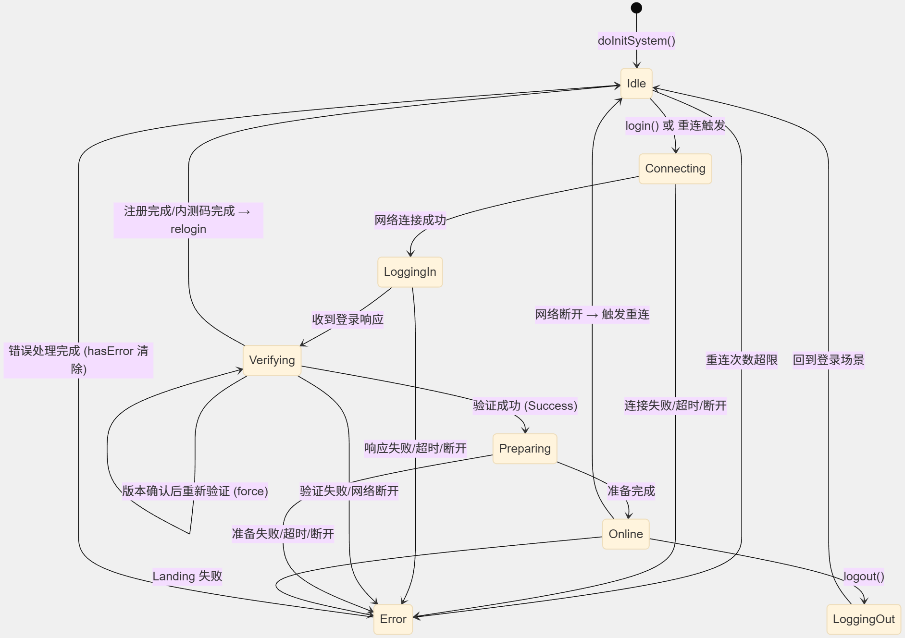

登录系统 [`TKLoginSystem`](command:gongfeng.gongfeng-copilot.chat.open-symbol-in-file?%5B%7B%22%24mid%22%3A1%2C%22fsPath%22%3A%22d%3A%5C%5CCode%5C%5CTSv2%5C%5CTikiStarMain_Dev_TMR%5C%5CTikiStar%5C%5CMainBundleScripts%5C%5CMinViableSystemSet%5C%5CSystems%5C%5CLoginSystem%5C%5CTKLoginSystem.ts%22%2C%22_sep%22%3A1%2C%22external%22%3A%22file%3A%2F%2F%2Fd%253A%2FCode%2FTSv2%2FTikiStarMain_Dev_TMR%2FTikiStar%2FMainBundleScripts%2FMinViableSystemSet%2FSystems%2FLoginSystem%2FTKLoginSystem.ts%22%2C%22path%22%3A%22%2Fd%3A%2FCode%2FTSv2%2FTikiStarMain_Dev_TMR%2FTikiStar%2FMainBundleScripts%2FMinViableSystemSet%2FSystems%2FLoginSystem%2FTKLoginSystem.ts%22%2C%22scheme%22%3A%22file%22%7D%2C%22TKLoginSystem%22%2C%5B%7B%22line%22%3A176%2C%22character%22%3A0%7D%2C%7B%22line%22%3A2082%2C%22character%22%3A1%7D%5D%5D) 是一个**常驻子系统**（继承自 [`SubsystemBase`](command:gongfeng.gongfeng-copilot.chat.open-symbol-in-file?%5B%7B%22%24mid%22%3A1%2C%22fsPath%22%3A%22d%3A%5C%5CCode%5C%5CTSv2%5C%5CTikiStarMain_Dev_TMR%5C%5CTikiStar%5C%5CMainBundleScripts%5C%5CMinViableSystemSet%5C%5CSystems%5C%5CLoginSystem%5C%5CTKLoginSystem.ts%22%2C%22_sep%22%3A1%2C%22external%22%3A%22file%3A%2F%2F%2Fd%253A%2FCode%2FTSv2%2FTikiStarMain_Dev_TMR%2FTikiStar%2FMainBundleScripts%2FMinViableSystemSet%2FSystems%2FLoginSystem%2FTKLoginSystem.ts%22%2C%22path%22%3A%22%2Fd%3A%2FCode%2FTSv2%2FTikiStarMain_Dev_TMR%2FTikiStar%2FMainBundleScripts%2FMinViableSystemSet%2FSystems%2FLoginSystem%2FTKLoginSystem.ts%22%2C%22scheme%22%3A%22file%22%7D%2C%22SubsystemBase%22%2C%5B%7B%22line%22%3A18%2C%22character%22%3A7%7D%2C%7B%22line%22%3A18%2C%22character%22%3A20%7D%5D%5D)），采用**有限状态机（FSM）**模式管理整个登录、重连、登出的生命周期。它实现了 `ITickable` 接口，每帧驱动状态机运转。

### 核心设计理念

1. **状态即行为**：每个状态是一个 [`ITKLoginStatusBehavior`](command:gongfeng.gongfeng-copilot.chat.open-symbol-in-file?%5B%7B%22%24mid%22%3A1%2C%22fsPath%22%3A%22d%3A%5C%5CCode%5C%5CTSv2%5C%5CTikiStarMain_Dev_TMR%5C%5CTikiStar%5C%5CMainBundleScripts%5C%5CMinViableSystemSet%5C%5CSystems%5C%5CLoginSystem%5C%5CTKLoginSystem.ts%22%2C%22_sep%22%3A1%2C%22external%22%3A%22file%3A%2F%2F%2Fd%253A%2FCode%2FTSv2%2FTikiStarMain_Dev_TMR%2FTikiStar%2FMainBundleScripts%2FMinViableSystemSet%2FSystems%2FLoginSystem%2FTKLoginSystem.ts%22%2C%22path%22%3A%22%2Fd%3A%2FCode%2FTSv2%2FTikiStarMain_Dev_TMR%2FTikiStar%2FMainBundleScripts%2FMinViableSystemSet%2FSystems%2FLoginSystem%2FTKLoginSystem.ts%22%2C%22scheme%22%3A%22file%22%7D%2C%22ITKLoginStatusBehavior%22%2C%5B%7B%22line%22%3A127%2C%22character%22%3A0%7D%2C%7B%22line%22%3A152%2C%22character%22%3A1%7D%5D%5D) 对象，包含 [`enter`](command:gongfeng.gongfeng-copilot.chat.open-symbol-in-file?%5B%7B%22%24mid%22%3A1%2C%22fsPath%22%3A%22d%3A%5C%5CCode%5C%5CTSv2%5C%5CTikiStarMain_Dev_TMR%5C%5CTikiStar%5C%5CMainBundleScripts%5C%5CMinViableSystemSet%5C%5CSystems%5C%5CLoginSystem%5C%5CTKLoginSystem.ts%22%2C%22_sep%22%3A1%2C%22external%22%3A%22file%3A%2F%2F%2Fd%253A%2FCode%2FTSv2%2FTikiStarMain_Dev_TMR%2FTikiStar%2FMainBundleScripts%2FMinViableSystemSet%2FSystems%2FLoginSystem%2FTKLoginSystem.ts%22%2C%22path%22%3A%22%2Fd%3A%2FCode%2FTSv2%2FTikiStarMain_Dev_TMR%2FTikiStar%2FMainBundleScripts%2FMinViableSystemSet%2FSystems%2FLoginSystem%2FTKLoginSystem.ts%22%2C%22scheme%22%3A%22file%22%7D%2C%22enter%22%2C%5B%7B%22line%22%3A132%2C%22character%22%3A4%7D%2C%7B%22line%22%3A132%2C%22character%22%3A23%7D%5D%5D)/[`tick`](command:gongfeng.gongfeng-copilot.chat.open-symbol-in-file?%5B%7B%22%24mid%22%3A1%2C%22fsPath%22%3A%22d%3A%5C%5CCode%5C%5CTSv2%5C%5CTikiStarMain_Dev_TMR%5C%5CTikiStar%5C%5CMainBundleScripts%5C%5CMinViableSystemSet%5C%5CSystems%5C%5CLoginSystem%5C%5CTKLoginSystem.ts%22%2C%22_sep%22%3A1%2C%22external%22%3A%22file%3A%2F%2F%2Fd%253A%2FCode%2FTSv2%2FTikiStarMain_Dev_TMR%2FTikiStar%2FMainBundleScripts%2FMinViableSystemSet%2FSystems%2FLoginSystem%2FTKLoginSystem.ts%22%2C%22path%22%3A%22%2Fd%3A%2FCode%2FTSv2%2FTikiStarMain_Dev_TMR%2FTikiStar%2FMainBundleScripts%2FMinViableSystemSet%2FSystems%2FLoginSystem%2FTKLoginSystem.ts%22%2C%22scheme%22%3A%22file%22%7D%2C%22tick%22%2C%5B%7B%22line%22%3A131%2C%22character%22%3A4%7D%2C%7B%22line%22%3A131%2C%22character%22%3A22%7D%5D%5D)/`leave` 生命周期回调和各种事件处理器
    
2. **事件驱动 + 轮询混合**：网络事件（连接成功、断开等）通过事件系统异步到达，状态机通过 [`tick`](command:gongfeng.gongfeng-copilot.chat.open-symbol-in-file?%5B%7B%22%24mid%22%3A1%2C%22fsPath%22%3A%22d%3A%5C%5CCode%5C%5CTSv2%5C%5CTikiStarMain_Dev_TMR%5C%5CTikiStar%5C%5CMainBundleScripts%5C%5CMinViableSystemSet%5C%5CSystems%5C%5CLoginSystem%5C%5CTKLoginSystem.ts%22%2C%22_sep%22%3A1%2C%22external%22%3A%22file%3A%2F%2F%2Fd%253A%2FCode%2FTSv2%2FTikiStarMain_Dev_TMR%2FTikiStar%2FMainBundleScripts%2FMinViableSystemSet%2FSystems%2FLoginSystem%2FTKLoginSystem.ts%22%2C%22path%22%3A%22%2Fd%3A%2FCode%2FTSv2%2FTikiStarMain_Dev_TMR%2FTikiStar%2FMainBundleScripts%2FMinViableSystemSet%2FSystems%2FLoginSystem%2FTKLoginSystem.ts%22%2C%22scheme%22%3A%22file%22%7D%2C%22tick%22%2C%5B%7B%22line%22%3A131%2C%22character%22%3A4%7D%2C%7B%22line%22%3A131%2C%22character%22%3A22%7D%5D%5D) 轮询检查超时、错误标志等同步条件
    
3. **错误延迟处理**：错误不立即切换状态，而是设置 [`hasError`](command:gongfeng.gongfeng-copilot.chat.open-symbol-in-file?%5B%7B%22%24mid%22%3A1%2C%22fsPath%22%3A%22d%3A%5C%5CCode%5C%5CTSv2%5C%5CTikiStarMain_Dev_TMR%5C%5CTikiStar%5C%5CMainBundleScripts%5C%5CMinViableSystemSet%5C%5CSystems%5C%5CLoginSystem%5C%5CTKLoginSystem.ts%22%2C%22_sep%22%3A1%2C%22external%22%3A%22file%3A%2F%2F%2Fd%253A%2FCode%2FTSv2%2FTikiStarMain_Dev_TMR%2FTikiStar%2FMainBundleScripts%2FMinViableSystemSet%2FSystems%2FLoginSystem%2FTKLoginSystem.ts%22%2C%22path%22%3A%22%2Fd%3A%2FCode%2FTSv2%2FTikiStarMain_Dev_TMR%2FTikiStar%2FMainBundleScripts%2FMinViableSystemSet%2FSystems%2FLoginSystem%2FTKLoginSystem.ts%22%2C%22scheme%22%3A%22file%22%7D%2C%22hasError%22%2C%5B%7B%22line%22%3A245%2C%22character%22%3A8%7D%2C%7B%22line%22%3A245%2C%22character%22%3A23%7D%5D%5D) 标志，在下一次 [`tick`](command:gongfeng.gongfeng-copilot.chat.open-symbol-in-file?%5B%7B%22%24mid%22%3A1%2C%22fsPath%22%3A%22d%3A%5C%5CCode%5C%5CTSv2%5C%5CTikiStarMain_Dev_TMR%5C%5CTikiStar%5C%5CMainBundleScripts%5C%5CMinViableSystemSet%5C%5CSystems%5C%5CLoginSystem%5C%5CTKLoginSystem.ts%22%2C%22_sep%22%3A1%2C%22external%22%3A%22file%3A%2F%2F%2Fd%253A%2FCode%2FTSv2%2FTikiStarMain_Dev_TMR%2FTikiStar%2FMainBundleScripts%2FMinViableSystemSet%2FSystems%2FLoginSystem%2FTKLoginSystem.ts%22%2C%22path%22%3A%22%2Fd%3A%2FCode%2FTSv2%2FTikiStarMain_Dev_TMR%2FTikiStar%2FMainBundleScripts%2FMinViableSystemSet%2FSystems%2FLoginSystem%2FTKLoginSystem.ts%22%2C%22scheme%22%3A%22file%22%7D%2C%22tick%22%2C%5B%7B%22line%22%3A131%2C%22character%22%3A4%7D%2C%7B%22line%22%3A131%2C%22character%22%3A22%7D%5D%5D) 中由当前状态的 [`onError`](command:gongfeng.gongfeng-copilot.chat.open-symbol-in-file?%5B%7B%22%24mid%22%3A1%2C%22fsPath%22%3A%22d%3A%5C%5CCode%5C%5CTSv2%5C%5CTikiStarMain_Dev_TMR%5C%5CTikiStar%5C%5CMainBundleScripts%5C%5CMinViableSystemSet%5C%5CSystems%5C%5CLoginSystem%5C%5CTKLoginSystem.ts%22%2C%22_sep%22%3A1%2C%22external%22%3A%22file%3A%2F%2F%2Fd%253A%2FCode%2FTSv2%2FTikiStarMain_Dev_TMR%2FTikiStar%2FMainBundleScripts%2FMinViableSystemSet%2FSystems%2FLoginSystem%2FTKLoginSystem.ts%22%2C%22path%22%3A%22%2Fd%3A%2FCode%2FTSv2%2FTikiStarMain_Dev_TMR%2FTikiStar%2FMainBundleScripts%2FMinViableSystemSet%2FSystems%2FLoginSystem%2FTKLoginSystem.ts%22%2C%22scheme%22%3A%22file%22%7D%2C%22onError%22%2C%5B%7B%22line%22%3A135%2C%22character%22%3A4%7D%2C%7B%22line%22%3A135%2C%22character%22%3A28%7D%5D%5D) 回调统一处理

