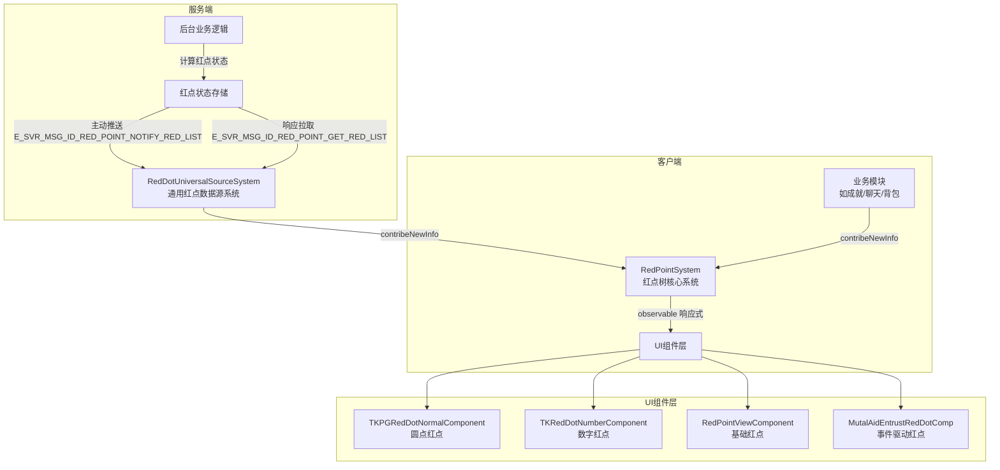
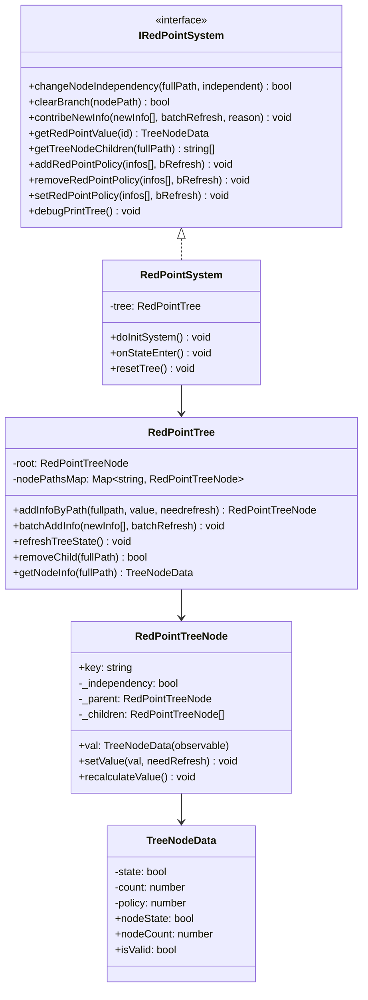
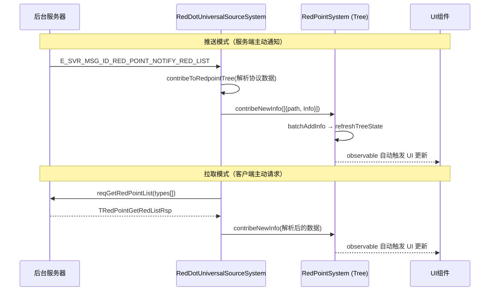
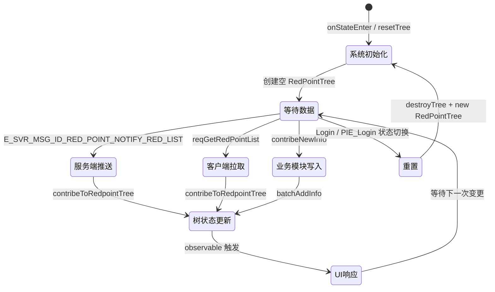
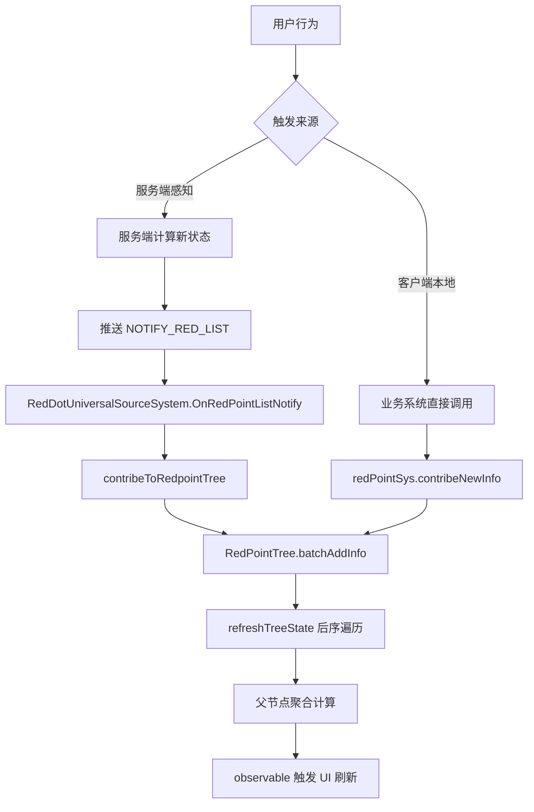

# 红点系统设计与实现方案

## 一、系统架构与实现

### 1.1 整体架构概览



### 1.2 前端实现方案

#### 1.2.1 技术选型与封装逻辑

红点系统基于 **树形数据结构 + 响应式观察者模式** 实现，核心技术栈：

| 技术 | 用途 | 文件位置 |
|---|---|---|
| `@nx-js/observer-util` 的 `observable` / `raw` | 节点值的响应式代理，UI 自动感知变化 | `RedPointSystem.ts` L7, L130 |
| IoC 依赖注入 (`@Inject`) | 系统间解耦，通过 `CoreObjectDefine.RedPointSystem` 注入 | 全局 |
| MVVM ViewComponent | UI 组件绑定红点数据 | `TKRedDotNormalComponent.ts` 等 |
| SubsystemBase | 红点系统作为框架级子系统，跟随游戏状态生命周期 | `RedPointSystem.ts` L517 |

**核心类层次结构：**



#### 1.2.2 红点状态管理机制

红点状态通过 **树形结构** 管理，每个节点使用 `observable(new TreeNodeData())` 包装，实现响应式绑定：

```typescript
// 节点数据结构 (RedPointSystem.ts)
export class TreeNodeData {
    private state: boolean = false;   // 是否亮灯
    private count: number = 0;        // 红点数字
    private policy: number = TreeNodePerformPolicy.Valid; // 有效性策略位掩码

    // 对外暴露的计算属性（受 policy 控制）
    public get nodeState(): boolean { return this.isValid && this.state; }
    public get nodeCount(): number { return this.isValid ? this.count : 0; }
    public get isValid(): boolean { return (this.policy & TreeNodePerformPolicy.Valid) > 0; }
}
```

**状态存储结构：**

```
nodePathsMap: Map<string, RedPointTreeNode>
├── "Root"
├── "Root.Main"
├── "Root.Main.Mail"
├── "Root.Main.Backpack"
├── "Root.Main.Backpack.Pet"
├── "Root.Main.Backpack.Pet.Avatar"
├── "Root.Main.Backpack.Pet.Skill"
├── "Root.Chatting"
├── "Root.Chatting.Comment"
└── ...
```

#### 1.2.3 不同层级红点的显示策略

| 组件 | UMG 资产 | 显示策略 | 适用场景 |
|---|---|---|---|
| `TKPGRedDotNormalComponent` | `WB_RedDot_Normal.uasset` | 纯圆点，多路径 OR 逻辑显示/隐藏 | 入口按钮、Tab 页签 |
| `TKRedDotNumberComponent` | `WB_RedDot_Number.uasset` | 显示数字，>99 时切换为 "99+" 样式 | 未读消息数、可领取奖励数 |
| `RedPointViewComponent` | `WB_RedDot.uasset` | 基础圆点，单路径绑定 | 简单场景 |
| `MutalAidEntrustRedDotComp` | `WB_RedDot_Normal.uasset` | 事件驱动，不依赖红点树 | 局部业务自控红点 |

**数字红点的溢出处理逻辑：**

```typescript
// TKRedDotNumberCompoenet.ts
// 使用 WidgetSwitcher 切换 "数字" 和 "99+" 两种显示模式
this.bindWidget(viewRes, "RedDot_WidgetSwitcher", "widgetSwitcher", {
    get activeIndex() {
        return valueToWatch.nodeCount > 99 ? 1 : 0; // 0=数字模式, 1=99+模式
    }
});
```

---

### 1.3 后端实现方案

#### 1.3.1 红点规则配置的数据结构设计

服务端通过协议枚举 `E_RED_POINT_TYPE` 定义红点类型，客户端通过 `RedPointSystemConfig` 建立映射：

```typescript
// RedDotConfig.ts - 协议类型到树路径的映射配置
export interface RedPointConfig {
    id?: number;          // 对应 SOCClient.E_RED_POINT_TYPE 枚举值
    path: string;         // 红点树中的完整路径
    description?: string; // 描述信息
}

export const RedPointSystemConfig: RedPointConfig[] = [
    { id: SOCClient.E_RED_POINT_TYPE.E_RED_POINT_TYPE_MAIL,
      path: DefinedRedDotPath.Mail, description: "邮箱系统" },
    { id: SOCClient.E_RED_POINT_TYPE.E_RED_POINT_TYPE_ACHIEVEMENT,
      path: DefinedRedDotPath.Achievement, description: "成就系统" },
    // ... 共 25+ 条配置
];
```

**服务端下发的数据结构（协议）：**

```typescript
// 服务端红点节点数据
interface ITRedPointNode {
    iType: E_RED_POINT_TYPE;    // 红点类型枚举
    stData: {
        iLightOff: number;      // >0 表示亮灯
        iStyle: number;         // 显示样式
        iData: number;          // 附加数据（如未读数）
    };
    vecRedSubList: Array<{      // 子节点列表
        iID: number;            // 子节点 ID
        stData: { iLightOff, iStyle, iData };
    }>;
}
```

#### 1.3.2 红点状态计算的核心算法

**父节点聚合算法（后序遍历）：**

```typescript
// RedPointSystem.ts - refreshTreeState()
public refreshTreeState() {
    this.forEach(ETreeTraveralPolicy.postOrder, (treeNode) => {
        if (!treeNode.isLeaf) {
            let newState = false;
            let newCount = 0;
            if (treeNode.independency) return; // 独立节点不受子节点影响
            for (let c of treeNode.children.values()) {
                if (c.val.nodeState) newState = true;  // OR 聚合
                newCount += c.val.nodeCount;            // SUM 聚合
            }
            treeNode.setValue({ nodeState: newState, nodeCount: newCount }, false);
        }
    });
}
```

**核心规则：**
- `nodeState`：子节点任一为 `true` → 父节点为 `true`（OR 逻辑）
- `nodeCount`：所有子节点 count 之和（SUM 逻辑）
- `independency` 节点：不受子节点影响，仅由外部直接设置

#### 1.3.3 与业务模块的数据交互方式



---

## 二、红点触发与更新流程

### 2.1 完整生命周期



#### 2.1.1 初始状态判定规则

1. **系统启动**：`onStateEnter()` 调用 `resetTree()`，创建空树（仅有 Root 节点）
2. **首次数据拉取**：`RedDotUniversalSourceSystem` 在登录后通过 `reqGetRedPointList([])` 拉取全量红点数据
3. **节点自动创建**：当 `getNodeInfo(fullPath)` 查询不存在的路径时，自动创建该路径上所有中间节点（初始值 `{nodeState: false, nodeCount: 0}`）

#### 2.1.2 用户行为触发的状态变更路径



**典型用户行为触发链：**
- 用户查看邮件 → 服务端标记已读 → 推送红点更新 → `Mail` 节点 state=false → 父节点 `Main` 重新聚合
- 用户获得新头像 → 服务端推送 → `PersonalInfo_BasicInfo_HeadIconEntry` 子节点亮灯 → 逐级向上传播

#### 2.1.3 跨模块联动的红点传播机制（父级红点聚合逻辑）

**自底向上传播：**

```typescript
// RedPointTreeNode.setValue() 触发父节点重算
public setValue(val: TreeNodeInfo, needRefresh: boolean = true): void {
    const countChanged = raw(this.val).rawCount != val.nodeCount;
    if (countChanged) this.val.nCount = val.nodeCount;
    const stateChanged = raw(this.val).rawState != val.nodeState;
    if (stateChanged) this.val.nState = val.nodeState;

    // 变更时通知父节点重新计算
    if (this.parent && needRefresh && (countChanged || stateChanged))
        this.parent.recalculateValue();
}
```

**传播示例：**

```
Root.Main.Backpack.Pet.Skill (state=true, count=2)
    ↑ 触发 recalculateValue
Root.Main.Backpack.Pet (state=true, count=2)  ← OR聚合
    ↑ 触发 recalculateValue
Root.Main.Backpack (state=true, count=2+其他子节点count)
    ↑ 触发 recalculateValue
Root.Main (state=true, count=总和)
```

**独立节点机制（阻断传播）：**

```typescript
// 设置节点为独立模式，不受子节点影响
this.redPointSys.changeNodeIndependency(RedPointConfig.path, true);
```

当服务端直接下发某个 Type 节点的状态时，该节点被设为 `independency=true`，其值由服务端直接控制，不被子节点覆盖。

### 2.2 状态同步策略

#### 2.2.1 客户端与服务端数据一致性方案

| 场景 | 同步策略 | 代码位置 |
|---|---|---|
| **登录后** | 客户端主动拉取全量 `reqGetRedPointList([])` | `RedDotUniversalSourceSystem` |
| **运行时** | 服务端主动推送 `E_SVR_MSG_ID_RED_POINT_NOTIFY_RED_LIST` | 网络事件监听 |
| **断线重连** | `onReconnectSuccess` 中主动拉取全量 | `RedDotUniversalSourceSystem.onReconnectSuccess` |
| **切前后台** | 切回前台时可拉取（当前代码已注释） | `initSwitchForeOrBackgroundProcess` |
| **游戏状态切换** | Login 状态时重置整棵树 | `onSwitchGameState` |

```typescript
// 断线重连后的同步逻辑
protected override onReconnectSuccess(data: ReconnectionData): void {
    // 在断连之后主动拉取红点树的信息
    this.reqGetRedPointList([]).then((result) => { });
}
```

#### 2.2.2 离线场景下的处理逻辑

- **切后台**：记录 `isInBackground = true`，切回前台时可触发数据刷新（当前实现中前台刷新逻辑已注释，依赖服务端推送）
- **断线**：重连成功后全量拉取，覆盖本地树状态
- **登录状态切换**：直接销毁整棵树并重建，确保无脏数据残留

---

## 三、典型用例分析

### 3.1 社交类场景：聊天评论红点

**路径定义：**
```typescript
Comment = "Root.Chatting.Comment",       // 聊天评论
Chatting = "Root.Chatting",              // 聊天入口
Chatting_Chat = "Root.Chatting.ChannelChat",    // 通用聊天
Chatting_PenguinBoss = "Root.Chatting.PenguinBoss", // 企鹅老板
```

**触发流程：**
1. 服务端检测到新评论 → 推送 `E_RED_POINT_TYPE_COMMENT` 类型红点
2. `RedDotUniversalSourceSystem` 接收并映射到 `Root.Chatting.Comment` 路径
3. 父节点 `Root.Chatting` 自动聚合为 `state=true`
4. 聊天入口 UI 组件绑定 `Root.Chatting` 路径，自动显示红点

### 3.2 任务类场景：成就系统红点

**路径定义：**
```typescript
Achievement = "Root.Main.Achievement",           // 成就入口
Achievement_Overview = "Root.Main.Achievement.Overview", // 成就概览
```

**触发流程：**
1. 服务端检测到成就完成 → 推送 `E_RED_POINT_TYPE_ACHIEVEMENT`
2. 映射到 `Root.Main.Achievement`，设置 `independency=true`
3. 父节点 `Root.Main` 聚合后显示红点
4. 用户进入成就界面领取奖励 → 服务端推送 `iLightOff=0` → 红点消失

### 3.3 背包类场景：多层级红点

**路径树：**
```
Root.Main.Backpack
├── Root.Main.Backpack.Pet
│   ├── Root.Main.Backpack.Pet.Avatar  (服务端: E_RED_POINT_TYPE_BACKPACK_ROLE)
│   └── Root.Main.Backpack.Pet.Skill   (服务端: E_RED_POINT_TYPE_BACKPACK_SKILL)
├── Root.Main.Backpack.Emoji           (服务端: E_RED_POINT_TYPE_BACKPACK_EMOJI)
└── Root.Main.Backpack.Prop
    ├── Root.Main.Backpack.Prop.Build  (服务端: E_RED_POINT_TYPE_BACKPACK_PROP_BUILD)
    ├── Root.Main.Backpack.Prop.Tool   (服务端: E_RED_POINT_TYPE_BACKPACK_PROP_TOOL)
    ├── Root.Main.Backpack.Prop.Farm   (服务端: E_RED_POINT_TYPE_BACKPACK_PROP_FARM)
    └── Root.Main.Backpack.Prop.Other  (服务端: E_RED_POINT_TYPE_BACKPACK_PROP_OTHER)
```

**特殊处理 — 场景适配器（RedPointAdapter）：**

进入家园场景时，光仔技能红点不应显示（因为家园中无法操作技能），通过 Policy 机制临时屏蔽：

```typescript
// HearthRedPointAdapterSystem.ts
protected override enter(): void {
    // 保存当前策略，并设置为无效
    this.skillRedPointAdapter.savePreRedPointPolicies([DefinedRedDotPath.Backpack_Pet_Skill]);
    this.skillRedPointAdapter.setRedPointValid([DefinedRedDotPath.Backpack_Pet_Skill], false);
}

protected override leave(): void {
    // 离开家园时恢复
    this.skillRedPointAdapter.restorePreSkillRedPointPolicies();
}
```

### 3.4 活动类场景：七日活动红点（客户端+服务端双源）

**路径树：**
```
Root.Main.Activity.Activity_InGame.Activity_SevenDay
├── Activity_SevenDay_Server  (服务端推送)
└── Activity_SevenDay_client  (客户端本地逻辑，如每日首次打开)
```

**设计要点：** 活动 Tab 红点显示逻辑是"前后台条件的 OR"，通过将服务端和客户端红点分别挂在不同子节点，父节点自动 OR 聚合实现。

---

## 四、新建红点开发规范

### 4.1 配置流程

#### 4.1.1 Step 1：在 `DefinedRedDotPath` 中定义路径

**文件：** `MainBundleScripts/MinViableSystemSet/Modules/RedDot/Config/RedDotConfig.ts`

```typescript
export const enum DefinedRedDotPath {
    // ... 已有定义
    
    // 新增：你的功能模块红点路径
    YourFeature = "Root.Main.YourFeature",                    // 功能入口
    YourFeature_SubA = "Root.Main.YourFeature.SubA",          // 子功能A
    YourFeature_SubB = "Root.Main.YourFeature.SubB",          // 子功能B
}
```

**命名规范：**
- 路径以 `Root` 开头，用 `.` 分隔层级
- 枚举名使用 PascalCase + 下划线分隔层级
- 注释说明对应的 UI 位置

#### 4.1.2 Step 2：如果由服务端驱动，添加协议映射

```typescript
// RedDotConfig.ts - RedPointSystemConfig 数组中添加
{
    id: SOCClient.E_RED_POINT_TYPE.E_RED_POINT_TYPE_YOUR_FEATURE,
    path: DefinedRedDotPath.YourFeature,
    description: "你的功能描述",
},
```

#### 4.1.3 Step 3：如果需要 `RedDotUniversalSourceSystem` 处理

在 `RedDodTypesToFollow` 数组中添加需要跟踪的类型：

```typescript
private RedDodTypesToFollow: SOCClient.E_RED_POINT_TYPE[] = [
    // ... 已有类型
    SOCClient.E_RED_POINT_TYPE.E_RED_POINT_TYPE_YOUR_FEATURE,
];
```

#### 4.1.4 Step 4：UI 组件绑定

**方式一：使用 `TKPGRedDotNormalComponent`（推荐，圆点红点）**

```typescript
import { TKPGRedDotNormalComponent } from "@mvss/Modules/RedDot/UI/TKRedDotNormalComponent";
import { DefinedRedDotPath } from "@mvss/Modules/RedDot/Config/RedDotConfig";

// 在 ViewComponent 的 onBind 中
this.bindComponent(viewRes, "WB_RedDot_YourEntry", TKPGRedDotNormalComponent, {
    RedDotPaths: [DefinedRedDotPath.YourFeature]  // 支持多路径 OR
});
```

**方式二：使用 `TKRedDotNumberComponent`（数字红点）**

```typescript
import { TKRedDotNumberCompoenet } from "@mvss/Modules/RedDot/UI/TKRedDotNumberCompoenet";

this.bindComponent(viewRes, "WB_RedDot_Number_YourEntry", TKRedDotNumberCompoenet, {
    RedDotPath: DefinedRedDotPath.YourFeature
});
```

**方式三：直接读取红点值（自定义显示逻辑）**

```typescript
@Inject(CoreObjectDefine.RedPointSystem)
private redPointSys: IRedPointSystem;

// 获取响应式数据
const redValue = this.redPointSys.getRedPointValue(DefinedRedDotPath.YourFeature);

this.bindWidget(viewRes, "YourWidget", "image", {
    get visible() { return redValue.nodeState; }
});
```

#### 4.1.5 Step 5：业务模块主动更新红点（客户端本地逻辑）

```typescript
@Inject(CoreObjectDefine.RedPointSystem)
private redPointSys: IRedPointSystem;

// 设置红点状态
this.redPointSys.contribeNewInfo([
    { path: DefinedRedDotPath.YourFeature_SubA, Info: { nodeState: true, nodeCount: 3 } }
], true, "YourFeature: new items available");

// 清除红点
this.redPointSys.contribeNewInfo([
    { path: DefinedRedDotPath.YourFeature_SubA, Info: { nodeState: false, nodeCount: 0 } }
], true, "YourFeature: user viewed items");
```

### 4.2 联调检查清单

#### 4.2.1 状态触发条件测试用例

| 测试项 | 验证方法 | 预期结果 |
|---|---|---|
| 红点初始状态 | 登录后观察 UI | 根据服务端数据正确显示 |
| 红点亮灯 | 触发业务条件（如获得新物品） | 对应路径及所有父节点红点亮起 |
| 红点熄灭 | 用户消费（如查看/领取） | 对应路径红点消失，父节点重新聚合 |
| 断线重连 | 断网后恢复 | 红点状态与服务端一致 |
| 场景切换 | 进入/离开特定场景 | Policy 正确切换，红点显隐正确 |
| 数字溢出 | count > 99 | 显示 "99+" 样式 |

#### 4.2.2 多端显示一致性验证要点

| 验证项 | 说明 |
|---|---|
| 路径一致性 | 确认 `DefinedRedDotPath` 中的路径与 UMG 中绑定的组件名一致 |
| 父子关系 | 确认路径层级正确，父节点能正确聚合子节点状态 |
| 独立节点 | 如果服务端直接控制某节点，确认设置了 `independency=true` |
| Policy 恢复 | 如果使用了 `RedPointAdapter`，确认 leave 时正确恢复 |
| 树重置 | 确认登录/登出时红点树正确重置，无脏数据 |

#### 4.2.3 GM 调试命令

```
redpointstate    — 打印当前红点树状态（树形结构）
redPointAllNode  — 打印所有节点的完整路径和值
GetRedPoint      — 手动拉取红点数据
UpdateRedPoint   — 手动更新指定红点（调试用）
```

---

## 五、关键代码文件索引

| 文件路径 | 职责 |
|---|---|
| `MainBundleScripts/Framework/RedPointSystem/RedPointSystem.ts` | 红点树核心实现（树结构、节点、聚合算法、系统接口） |
| `MainBundleScripts/Framework/RedPointSystem/RedPointAdapter.ts` | 红点策略适配器（场景切换时保存/恢复 Policy） |
| `MainBundleScripts/Framework/RedPointSystem/RedPointUtils.ts` | 工具类（序列化/反序列化红点状态） |
| `MainBundleScripts/Framework/RedPointSystem/RedPointViewComponent.ts` | 基础红点 UI 组件 |
| `MainBundleScripts/MinViableSystemSet/Modules/RedDot/Config/RedDotConfig.ts` | 红点路径枚举 + 协议映射配置 |
| `MainBundleScripts/MinViableSystemSet/Modules/RedDot/System/RedDotUniversalSourceSystem.ts` | 通用红点数据源（网络收发、前后台处理） |
| `MainBundleScripts/MinViableSystemSet/Modules/RedDot/UI/TKRedDotNormalComponent.ts` | 圆点红点 UI 组件（多路径 OR） |
| `MainBundleScripts/MinViableSystemSet/Modules/RedDot/UI/TKRedDotNumberCompoenet.ts` | 数字红点 UI 组件（含 99+ 溢出） |
| `MainBundleScripts/Framework/Configs/CoreObjectDefine.ts` | IoC 容器注册（`RedPointSystem` Symbol） |
| `Plugins/GameFeatures/Hearthbound/.../HearthRedPointAdapterSystem.ts` | 家园场景红点适配示例 |
| `MainBundleScripts/Framework/RedPointSystem/Demo/` | 红点系统 Demo 示例代码 |

---

## 六、设计亮点与注意事项

### 6.1 设计亮点

1. **响应式驱动**：基于 `@nx-js/observer-util` 的 `observable`，节点值变化自动触发 UI 更新，无需手动刷新
2. **树形聚合**：父节点自动聚合子节点状态，新增叶子节点无需修改父级逻辑
3. **Policy 机制**：通过位掩码控制节点有效性，支持场景级别的红点屏蔽/恢复
4. **独立节点**：`independency` 标记允许服务端直接控制中间节点，不被子节点覆盖
5. **批量更新**：`batchAddInfo` + `refreshTreeState` 避免频繁的逐节点传播计算
6. **自动创建中间节点**：查询不存在的路径时自动补全路径链，降低配置负担

### 6.2 注意事项

1. **路径命名**：必须以 `Root.` 开头，层级用 `.` 分隔，不能有前导/尾随 `.`
2. **独立节点与子节点**：设置 `independency=true` 后，该节点的 `recalculateValue` 不再聚合子节点
3. **树重置时机**：Login/PIE_Login 状态切换时整棵树会被销毁重建，业务模块需在重建后重新写入数据
4. **性能考虑**：`refreshTreeState` 是全树后序遍历，频繁调用时建议使用 `batchRefresh=true` 合并
5. **前后台切换**：当前前台恢复时的主动拉取逻辑已注释，依赖服务端推送保证一致性
